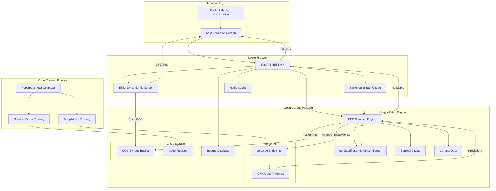
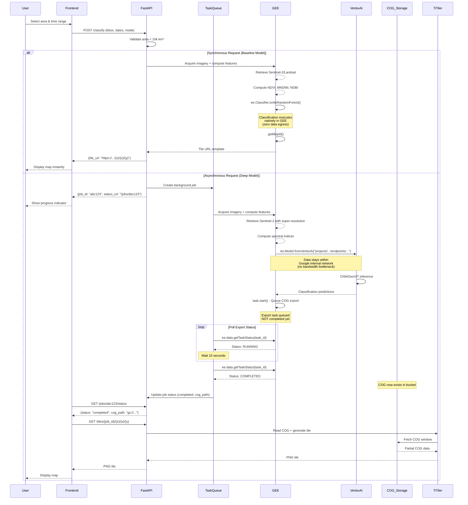

# Design Document: Urban Expansion Analysis System

## Overview

The Urban Expansion Analysis System is a cloud-native, AI-driven platform for monitoring and analyzing land use and land cover (LULC) changes using satellite imagery. The system architecture is designed around four core principles:

1. **Zero-Egress Compute**: All heavy processing executes natively within Google Cloud infrastructure (GEE and Vertex AI), eliminating data transfer bottlenecks
2. **Dynamic Tiling**: Classification results are stored as Cloud Optimized GeoTIFFs (COGs) and served on-demand via TiTiler, eliminating pre-rendered tile storage
3. **Internal Network Communication**: GEE communicates directly with Vertex AI for deep learning inference, keeping data within Google's private network
4. **Asynchronous Processing**: Real-time requests use GEE-native classifiers while computationally intensive tasks run as background jobs with Vertex AI

The system processes multi-temporal satellite imagery (Sentinel-2 at 10m resolution and Landsat for historical data), extracts spectral features (NDVI, MNDWI, NDBI), performs multi-class classification using machine learning models, and visualizes results through an interactive web interface with synchronized split-screen comparison capabilities.

### Key Design Decisions

- **GEE-Native Classification**: Random Forest executes directly in GEE using ee.Classifier.smileRandomForest(), eliminating data egress and enabling instant tile generation via getMapId()
- **Vertex AI Integration**: Deep learning models (CNN/GeoViT) are hosted on Vertex AI and accessed from GEE using ee.Model.fromVertexAi(), keeping heavy compute within Google's internal network
- **Cloud Optimized GeoTIFFs (COGs)**: Final classification results are exported as single COG files instead of millions of pre-rendered tiles, dramatically reducing storage costs
- **TiTiler Dynamic Tiling**: Lightweight tile server reads COGs from Cloud Storage and generates XYZ tiles on-demand, eliminating tile pre-generation overhead
- **FastAPI Backend**: Orchestrates workflows, manages job state, and serves as API gateway between frontend and cloud services
- **Next.js Frontend**: Provides server-side rendering, optimal performance, and seamless integration with modern React ecosystem
- **Deck.gl/Mapbox**: Enables high-performance WebGL rendering of large-scale geospatial visualizations
- **Optuna Integration**: Automates hyperparameter optimization for model training, eliminating manual tuning requirements

## Architecture

### High-Level System Architecture



### Data Flow Architecture

The system implements a dual-path pipeline optimized for zero-egress compute:

**Synchronous Path (Real-Time Classification):**
1. **Request Ingestion**: Frontend submits bounding box and time range
2. **Area Validation**: Backend validates bounding box size (<10,000 km²)
3. **GEE Image Acquisition**: GEE retrieves Sentinel-2/Landsat imagery with cloud masking
4. **Feature Extraction**: GEE computes NDVI, MNDWI, NDBI and stacks with original bands
5. **GEE-Native Classification**: ee.Classifier.smileRandomForest() executes directly in GEE
6. **Instant Tile Generation**: GEE's getMapId() returns XYZ tile URL immediately (no data egress)
7. **Response Delivery**: Frontend receives tile URL and renders map instantly

**Asynchronous Path (High-Accuracy Classification):**
1. **Job Creation**: Backend creates background task and returns Job_ID
2. **GEE Image Acquisition**: TaskQueue worker triggers GEE to acquire imagery
3. **Feature Extraction**: GEE computes spectral indices and stacks features
4. **Vertex AI Inference**: GEE calls ee.Model.fromVertexAi() to invoke CNN/GeoViT (internal network)
5. **Classification Result**: Vertex AI returns predictions to GEE (no data leaves Google Cloud)
6. **COG Export Initiation**: GEE starts batch export task to Cloud Storage (task.start())
7. **Export Polling**: TaskQueue worker polls GEE task status (RUNNING → COMPLETED) until export finishes
8. **Job Status Update**: Only after GEE confirms COMPLETED, backend updates job status with COG path
9. **Dynamic Tiling**: TiTiler reads COG and serves XYZ tiles on-demand to frontend

**Transition Matrix Computation:**
10. **Temporal Comparison**: System loads two COGs, computes pixel-wise class transitions, generates 4x4 matrix with area in km²

### Component Interaction Flow



## Components and Interfaces

### 1. FastAPI Backend Service

**Responsibilities:**
- Expose REST API endpoints for classification requests
- Validate bounding box constraints and enforce area limits
- Manage asynchronous task lifecycle (creation, status tracking, result retrieval)
- Interface with GEE Python API for geospatial operations
- Orchestrate communication between GEE and Vertex AI
- Proxy tile requests to TiTiler for COG-based dynamic tiling
- Implement rate limiting and quota management

**Key Interfaces:**

```python
# POST /api/v1/classify
class ClassificationRequest:
    bbox: BoundingBox  # [min_lon, min_lat, max_lon, max_lat]
    start_date: str    # ISO 8601 format
    end_date: str      # ISO 8601 format
    mode: str          # "sync" or "async"
    model_type: str    # "baseline" or "deep"
    enable_super_res: bool = False

class ClassificationResponse:
    job_id: Optional[str]  # Present for async requests
    tile_url: Optional[str]  # Present for sync requests (GEE getMapId URL)
    cog_path: Optional[str]  # Present for async requests (Cloud Storage path)
    status: str  # "completed", "processing", "queued"
    estimated_time: Optional[int]  # Seconds, for async requests

# GET /api/v1/jobs/{job_id}/status
class JobStatus:
    job_id: str
    status: str  # "queued", "processing", "completed", "failed"
    progress: int  # 0-100
    cog_path: Optional[str]  # Cloud Storage path to COG
    tile_url: Optional[str]  # TiTiler endpoint for dynamic tiles
    error: Optional[str]

# GET /api/v1/tiles/{job_id}/{z}/{x}/{y}.png
# Proxies to TiTiler for dynamic tile generation from COG

# GET /api/v1/transition-matrix/{job_id}
class TransitionMatrix:
    job_id: str
    matrix: Dict[str, Dict[str, float]]  # {from_class: {to_class: area_km2}}
    summary: List[Transition]  # Top 3 transitions
    total_area_changed: float  # km²

class Transition:
    from_class: str
    to_class: str
    area_km2: float
    percentage: float
```

### 2. Google Earth Engine Integration Layer

**Responsibilities:**
- Authenticate with GEE using service account credentials
- Query Sentinel-2 and Landsat image collections
- Apply cloud masking using QA bands
- Compute spectral indices (NDVI, MNDWI, NDBI) natively in GEE
- Execute Random Forest classification using ee.Classifier.smileRandomForest()
- Invoke Vertex AI models using ee.Model.fromVertexAi() for deep learning inference
- Generate instant tile URLs via getMapId() for synchronous requests
- Export classification results as Cloud Optimized GeoTIFFs for asynchronous requests

**Key Operations:**

```python
class GEEProcessor:
    def acquire_imagery(bbox: BoundingBox, date_range: DateRange, 
                       season_lock: bool = True) -> ee.Image:
        """
        Retrieves cloud-masked imagery for specified area and time.
        Enforces seasonal consistency if season_lock=True.
        """
        pass
    
    def compute_spectral_indices(image: ee.Image) -> ee.Image:
        """
        Computes NDVI, MNDWI, NDBI from raw bands natively in GEE.
        Returns stacked multi-band image.
        """
        pass
    
    def classify_with_random_forest(feature_stack: ee.Image, 
                                   training_data: ee.FeatureCollection) -> ee.Image:
        """
        Trains and applies ee.Classifier.smileRandomForest() directly in GEE.
        Returns single-band classification image with class labels.
        No data egress - everything executes server-side.
        """
        classifier = ee.Classifier.smileRandomForest(numberOfTrees=100)
        trained = classifier.train(training_data, 'class', feature_stack.bandNames())
        return feature_stack.classify(trained)
    
    def classify_with_vertex_ai(feature_stack: ee.Image, 
                               vertex_endpoint: str) -> ee.Image:
        """
        Invokes Vertex AI model using ee.Model.fromVertexAi().
        Data stays within Google Cloud internal network.
        Returns classification predictions from CNN/GeoViT.
        """
        model = ee.Model.fromVertexAi(
            endpoint=vertex_endpoint,
            inputTileSize=[256, 256],
            inputOverlapSize=[32, 32],
            proj=ee.Projection('EPSG:4326').atScale(10),
            fixInputProj=True,
            outputBands={'prediction': {'type': ee.PixelType.int8()}}
        )
        return model.predictImage(feature_stack)
    
    def get_tile_url_instant(classified_image: ee.Image, 
                            vis_params: Dict) -> str:
        """
        Uses GEE's getMapId() to generate instant tile URL.
        No tile pre-rendering required - GEE serves tiles on-demand.
        Returns XYZ tile URL template.
        """
        map_id = classified_image.getMapId(vis_params)
        return map_id['tile_fetcher'].url_format
    
    def export_as_cog(classified_image: ee.Image, 
                     bbox: BoundingBox,
                     output_bucket: str) -> Tuple[str, str]:
        """
        Initiates COG export to Cloud Storage and returns task ID for polling.
        
        CRITICAL: task.start() only QUEUES the export - it does NOT wait for completion.
        The caller MUST poll task status using ee.data.getTaskStatus(task_id) until
        the status changes from RUNNING to COMPLETED before accessing the COG file.
        
        Returns:
            Tuple[task_id, expected_cog_path]: Task ID for polling and expected GCS path
        """
        task = ee.batch.Export.image.toCloudStorage(
            image=classified_image,
            description='classification_result',
            bucket=output_bucket,
            fileFormat='GeoTIFF',
            region=bbox.to_ee_geometry(),
            scale=10,
            formatOptions={'cloudOptimized': True}
        )
        task.start()
        
        # Return task ID for polling - COG does NOT exist yet!
        task_id = task.id
        expected_path = f"gs://{output_bucket}/{task_id}.tif"
        return task_id, expected_path
    
    def poll_export_status(task_id: str, 
                          poll_interval: int = 10,
                          max_wait: int = 3600) -> str:
        """
        Polls GEE batch task status until completion or timeout.
        
        Args:
            task_id: GEE task ID returned from export_as_cog
            poll_interval: Seconds to wait between status checks
            max_wait: Maximum seconds to wait before timing out
            
        Returns:
            Final task status: "COMPLETED", "FAILED", or "CANCELLED"
            
        Raises:
            TimeoutError: If task does not complete within max_wait seconds
        """
        import time
        elapsed = 0
        
        while elapsed < max_wait:
            status = ee.data.getTaskStatus(task_id)[0]
            state = status['state']
            
            if state == 'COMPLETED':
                return 'COMPLETED'
            elif state in ['FAILED', 'CANCELLED']:
                error_msg = status.get('error_message', 'Unknown error')
                raise RuntimeError(f"GEE export failed: {error_msg}")
            
            # Still RUNNING or READY - wait and check again
            time.sleep(poll_interval)
            elapsed += poll_interval
        
        raise TimeoutError(f"GEE export did not complete within {max_wait} seconds")
    
    def compute_transition_matrix(image_t1: ee.Image, 
                                 image_t2: ee.Image) -> Dict:
        """
        Computes pixel-wise class transitions between two time periods.
        Returns matrix with area in km².
        """
        pass
```

### 3. Machine Learning Pipeline

**Responsibilities:**
- Train baseline Random Forest models on labeled training data
- Train deep learning models (CNN, GeoViT) for deployment to Vertex AI
- Optimize hyperparameters using Optuna framework
- Evaluate models using confusion matrices and per-class metrics
- Deploy trained deep models to Vertex AI endpoints
- Manage model versioning and registry

**Model Architecture:**

```python
class BaselineClassifier:
    """Random Forest for GEE-native real-time inference (<3s)"""
    def __init__(self, n_classes: int = 4):
        self.model = RandomForestClassifier(n_estimators=100)
    
    def train(self, X: np.ndarray, y: np.ndarray, 
             optimize: bool = True) -> Metrics:
        """
        Trains model on feature stack (X) and labels (y).
        Uses Optuna if optimize=True.
        Model is exported to GEE format for ee.Classifier.smileRandomForest().
        """
        pass
    
    def export_to_gee_format(self) -> Dict:
        """
        Exports trained Random Forest to format compatible with
        ee.Classifier.smileRandomForest() for server-side execution.
        """
        pass

class DeepClassifier:
    """CNN or GeoViT for high-accuracy Vertex AI inference"""
    def __init__(self, architecture: str = "CNN"):
        self.model = self._build_model(architecture)
    
    def train(self, train_loader: DataLoader, 
             val_loader: DataLoader, epochs: int = 50) -> Metrics:
        """
        Trains deep model with early stopping and learning rate scheduling.
        """
        pass
    
    def deploy_to_vertex_ai(self, project_id: str, 
                           endpoint_name: str) -> str:
        """
        Deploys trained model to Vertex AI endpoint.
        Returns endpoint URL for use with ee.Model.fromVertexAi().
        """
        from google.cloud import aiplatform
        
        aiplatform.init(project=project_id)
        model = aiplatform.Model.upload(
            display_name=endpoint_name,
            artifact_uri=self.model_path,
            serving_container_image_uri="us-docker.pkg.dev/vertex-ai/prediction/pytorch-gpu:latest"
        )
        endpoint = model.deploy(
            machine_type="n1-standard-4",
            accelerator_type="NVIDIA_TESLA_T4",
            accelerator_count=1
        )
        return endpoint.resource_name

class OptunaOptimizer:
    def optimize_baseline(self, X: np.ndarray, y: np.ndarray, 
                         n_trials: int = 100) -> Dict:
        """Optimizes Random Forest hyperparameters"""
        pass
    
    def optimize_deep(self, train_loader: DataLoader, 
                     val_loader: DataLoader, n_trials: int = 50) -> Dict:
        """Optimizes CNN/GeoViT architecture and training params"""
        pass
```

### 4. Background Task Queue

**Responsibilities:**
- Manage asynchronous job lifecycle
- Execute long-running tasks (deep learning inference, super-resolution, COG export)
- Poll GEE batch task status until completion
- Provide progress tracking and status updates
- Handle task failures and retries
- Implement worker pool for parallel processing

**Implementation:**

```python
class TaskQueue:
    def __init__(self, max_workers: int = 4):
        self.executor = ThreadPoolExecutor(max_workers=max_workers)
        self.jobs: Dict[str, Job] = {}
    
    def submit_job(self, request: ClassificationRequest) -> str:
        """
        Creates job, assigns Job_ID, submits to worker pool.
        Returns Job_ID for polling.
        """
        pass
    
    def execute_async_classification(self, job_id: str, 
                                     request: ClassificationRequest):
        """
        Worker function that executes the full async pipeline:
        1. Acquire imagery from GEE
        2. Invoke Vertex AI model via ee.Model.fromVertexAi()
        3. Initiate COG export (task.start())
        4. Poll GEE task status until COMPLETED
        5. Update job status with COG path only after export finishes
        
        CRITICAL: Must poll GEE export status before marking job complete.
        """
        try:
            self.jobs[job_id].status = "processing"
            self.jobs[job_id].progress = 10
            
            # Steps 1-3: Acquire, classify, initiate export
            gee_processor = GEEProcessor()
            image = gee_processor.acquire_imagery(request.bbox, request.date_range)
            features = gee_processor.compute_spectral_indices(image)
            classified = gee_processor.classify_with_vertex_ai(
                features, 
                vertex_endpoint=VERTEX_AI_ENDPOINT
            )
            
            self.jobs[job_id].progress = 50
            
            # Step 4: Start export and get task ID
            task_id, expected_cog_path = gee_processor.export_as_cog(
                classified, 
                request.bbox, 
                output_bucket=COG_BUCKET
            )
            
            self.jobs[job_id].progress = 60
            
            # Step 5: CRITICAL - Poll until export completes
            # COG does NOT exist yet - must wait for GEE to finish
            final_status = gee_processor.poll_export_status(
                task_id, 
                poll_interval=10, 
                max_wait=3600
            )
            
            if final_status == "COMPLETED":
                # NOW the COG exists and can be accessed
                self.jobs[job_id].status = "completed"
                self.jobs[job_id].progress = 100
                self.jobs[job_id].result = ClassificationResponse(
                    job_id=job_id,
                    cog_path=expected_cog_path,
                    tile_url=f"/api/v1/tiles/{job_id}/{{z}}/{{x}}/{{y}}.png",
                    status="completed"
                )
            else:
                raise RuntimeError(f"GEE export failed with status: {final_status}")
                
        except Exception as e:
            self.jobs[job_id].status = "failed"
            self.jobs[job_id].error = str(e)
    
    def get_status(self, job_id: str) -> JobStatus:
        """Returns current job status and progress"""
        pass
    
    def cancel_job(self, job_id: str) -> bool:
        """Attempts to cancel running job"""
        pass

class Job:
    job_id: str
    status: str  # "queued", "processing", "completed", "failed"
    progress: int  # 0-100
    result: Optional[ClassificationResponse]
    error: Optional[str]
    created_at: datetime
    updated_at: datetime
```

### 5. Next.js Frontend Application

**Responsibilities:**
- Provide interactive map interface using Deck.gl/Mapbox
- Implement bounding box selection tool
- Display classification results as tile layers
- Implement synchronized split-screen mode
- Poll asynchronous job status and display progress
- Render transition matrix visualizations
- Handle error states and user feedback

**Key Components:**

```typescript
// Map visualization component
interface MapViewProps {
  tileUrl: string;
  bbox: BoundingBox;
  splitScreenMode: boolean;
  comparisonTileUrl?: string;
}

// Classification request form
interface ClassificationFormProps {
  onSubmit: (request: ClassificationRequest) => void;
  maxAreaKm2: number;
}

// Job status polling component
interface JobStatusProps {
  jobId: string;
  pollingInterval: number;
  onComplete: (result: ClassificationResponse) => void;
}

// Transition matrix visualization
interface TransitionMatrixProps {
  matrix: TransitionMatrix;
  colorScheme: ColorScheme;
}
```

### 6. TiTiler Dynamic Tile Server

**Responsibilities:**
- Read Cloud Optimized GeoTIFFs from Cloud Storage on-demand
- Generate XYZ PNG tiles dynamically for requested zoom/x/y coordinates
- Apply color mapping and styling to classification results
- Cache frequently accessed tiles in memory
- Serve tiles with appropriate HTTP headers for browser caching

**Implementation:**

```python
class TiTilerService:
    """
    Lightweight tile server that reads COGs and generates tiles on-the-fly.
    Eliminates need for pre-rendering millions of tiles.
    """
    
    def __init__(self, cog_bucket: str):
        self.cog_bucket = cog_bucket
        self.cache = LRUCache(maxsize=1000)
    
    def get_tile(self, cog_path: str, z: int, x: int, y: int, 
                colormap: str = "viridis") -> bytes:
        """
        Reads partial COG data for requested tile bounds.
        Applies colormap and returns PNG bytes.
        
        Uses COG's internal tiling structure for efficient random access.
        Only reads the specific tile window, not the entire file.
        """
        cache_key = f"{cog_path}:{z}:{x}:{y}:{colormap}"
        if cache_key in self.cache:
            return self.cache[cache_key]
        
        # Open COG with GDAL/rasterio (supports HTTP range requests)
        with rasterio.open(f"/vsigs/{cog_path}") as src:
            # Calculate tile bounds in geographic coordinates
            tile_bounds = mercantile.bounds(x, y, z)
            
            # Read only the window corresponding to this tile
            window = src.window(*tile_bounds)
            data = src.read(1, window=window)
            
            # Apply colormap and convert to PNG
            png_bytes = self._apply_colormap_and_encode(data, colormap)
            
            self.cache[cache_key] = png_bytes
            return png_bytes
    
    def _apply_colormap_and_encode(self, data: np.ndarray, 
                                   colormap: str) -> bytes:
        """
        Maps classification values (0-3) to colors and encodes as PNG.
        """
        # Map class values to RGB colors
        color_map = {
            0: [255, 0, 0],    # Urban: Red
            1: [0, 255, 0],    # Vegetation: Green
            2: [0, 0, 255],    # Water: Blue
            3: [139, 69, 19]   # Barren: Brown
        }
        
        rgb_image = np.zeros((*data.shape, 3), dtype=np.uint8)
        for class_id, color in color_map.items():
            mask = data == class_id
            rgb_image[mask] = color
        
        # Encode as PNG
        img = Image.fromarray(rgb_image)
        buffer = io.BytesIO()
        img.save(buffer, format='PNG')
        return buffer.getvalue()

# FastAPI endpoint integration
@app.get("/tiles/{job_id}/{z}/{x}/{y}.png")
async def serve_tile(job_id: str, z: int, x: int, y: int):
    """
    Proxies tile requests to TiTiler service.
    Looks up COG path from job_id and generates tile on-demand.
    """
    job = await get_job_status(job_id)
    if not job.cog_path:
        raise HTTPException(status_code=404, detail="COG not found for job")
    
    tile_bytes = titiler_service.get_tile(job.cog_path, z, x, y)
    return Response(content=tile_bytes, media_type="image/png",
                   headers={"Cache-Control": "public, max-age=86400"})
```

**Key Benefits:**
- **Storage Efficiency**: Single COG file (~100MB) vs millions of pre-rendered tiles (~10GB)
- **Flexibility**: Can change colormaps or styling without re-rendering
- **Performance**: COG's internal tiling enables fast random access
- **Scalability**: Stateless service can be horizontally scaled

## Data Models

### Architectural Rationale

**1. GEE-Native Classification (Zero Egress)**

Traditional approach: Download imagery from GEE → Transfer to backend → Run classification → Upload results back to GEE for tiling. This creates massive data egress costs and bandwidth bottlenecks.

Optimized approach: Execute Random Forest classification directly in GEE using ee.Classifier.smileRandomForest(). The entire pipeline (imagery acquisition → feature extraction → classification → tile generation) runs server-side within GEE infrastructure. The getMapId() function returns a tile URL instantly without any data leaving GEE.

Benefits:
- Zero data egress costs
- Sub-second response times (no network transfer delays)
- Eliminates backend memory constraints
- Leverages GEE's distributed compute infrastructure

**2. Vertex AI Integration (Internal Network Communication)**

Traditional approach: Download multi-band feature stack from GEE → Transfer to backend workers → Run CNN/GeoViT inference → Upload results back to GEE. For large areas, this can involve transferring gigabytes of data over the public internet.

Optimized approach: Host deep learning models on Vertex AI endpoints. GEE communicates directly with Vertex AI using ee.Model.fromVertexAi() over Google's internal network. The feature stack never leaves Google Cloud infrastructure.

Benefits:
- No bandwidth bottlenecks (internal network is 10-100x faster than public internet)
- No memory failures in backend workers
- Automatic GPU scaling via Vertex AI
- Data stays within Google Cloud security boundary

**3. Cloud Optimized GeoTIFFs + TiTiler (Dynamic Tiling)**

Traditional approach: Pre-render millions of PNG tiles for zoom levels 8-15 and store them individually. For a single classification result covering 10,000 km², this generates ~2 million tiles consuming ~10GB of storage.

Optimized approach: Export classification result as a single Cloud Optimized GeoTIFF (~100MB). TiTiler reads the COG on-demand and generates tiles dynamically when requested. COG's internal tiling structure enables efficient random access to specific geographic windows.

Benefits:
- 100x storage reduction (100MB vs 10GB)
- Flexibility to change colormaps without re-rendering
- Faster result delivery (no waiting for tile pre-generation)
- Stateless tile server can be horizontally scaled

### Geospatial Data Structures

```python
class BoundingBox:
    min_lon: float  # -180 to 180
    min_lat: float  # -90 to 90
    max_lon: float  # -180 to 180
    max_lat: float  # -90 to 90
    
    def area_km2(self) -> float:
        """Computes approximate area using Haversine formula"""
        pass
    
    def validate(self) -> bool:
        """Ensures valid coordinate ranges and min < max"""
        pass

class DateRange:
    start: date
    end: date
    season: Optional[str]  # "winter", "spring", "summer", "fall"
    
    def enforce_seasonal_lock(self, other: 'DateRange') -> bool:
        """Checks if both date ranges are in same season"""
        pass

class SpectralIndices:
    ndvi: np.ndarray  # Normalized Difference Vegetation Index
    mndwi: np.ndarray  # Modified Normalized Difference Water Index
    ndbi: np.ndarray  # Normalized Difference Built-up Index
    
    def validate_ranges(self) -> bool:
        """Ensures all indices are in [-1, 1] range"""
        pass
```

### Classification Results

```python
class ClassificationResult:
    job_id: str
    bbox: BoundingBox
    date_range: DateRange
    class_labels: np.ndarray  # 2D array with class IDs (0-3)
    class_probabilities: np.ndarray  # 3D array (height, width, 4 classes)
    tile_url: str
    metadata: ClassificationMetadata

class ClassificationMetadata:
    model_type: str  # "baseline" or "deep"
    model_version: str
    overall_accuracy: Optional[float]
    per_class_f1: Optional[Dict[str, float]]
    processing_time_seconds: float
    imagery_source: str  # "Sentinel-2" or "Landsat"
    cloud_cover_percentage: float

class LandCoverClass(Enum):
    URBAN = 0
    VEGETATION = 1
    WATER = 2
    BARREN = 3
```

### Transition Analysis

```python
class TransitionMatrix:
    from_period: DateRange
    to_period: DateRange
    matrix: np.ndarray  # 4x4 matrix (from_class, to_class) in km²
    
    def get_transition(self, from_class: LandCoverClass, 
                      to_class: LandCoverClass) -> float:
        """Returns area in km² for specific transition"""
        pass
    
    def natural_resource_loss(self) -> float:
        """
        Computes total area of Vegetation + Water converted to Urban.
        Returns area in km².
        """
        pass
    
    def top_transitions(self, n: int = 3) -> List[Transition]:
        """Returns n largest transitions by area"""
        pass
```

## Correctness Properties

*A property is a characteristic or behavior that should hold true across all valid executions of a system—essentially, a formal statement about what the system should do. Properties serve as the bridge between human-readable specifications and machine-verifiable correctness guarantees.*

Before defining the correctness properties, I need to analyze the acceptance criteria from the requirements document to determine which are testable as properties, examples, or edge cases.


### Property Reflection

After analyzing all acceptance criteria, I've identified several areas where properties can be consolidated:

**Redundancy Analysis:**

1. **Spectral Index Computation (2.1, 2.2, 2.3)**: These three properties all test formula correctness for different indices. They can be combined into a single property that tests all spectral indices are computed with correct formulas.

2. **API Endpoint Existence (9.1, 9.4, 9.5)**: These are testing that specific endpoints exist. These are better tested as examples rather than separate properties.

3. **Synchronization Properties (8.2, 8.3)**: Pan and zoom synchronization are both testing the same synchronization mechanism. They can be combined into a single property about viewport synchronization.

4. **Async Response Structure (6.4, 9.3)**: Both test that async tasks return Job_ID. These are redundant and can be combined.

5. **Tile Format and Structure (7.1, 7.3)**: Both test tile output format. Can be combined into a single property about tile rendering.

**Properties to Keep Separate:**
- Input validation properties (6.1, 6.2) - different aspects of validation
- Model routing properties (1.2, 3.3, 6.3) - different routing decisions
- Transition matrix properties (5.1-5.5) - each tests different computation aspects
- Feature extraction properties (2.4, 2.5) - structure vs validation

### Correctness Properties

Property 1: Imagery Retrieval for Valid Inputs
*For any* valid bounding box and time range, the system should successfully retrieve satellite imagery with 10m resolution from the appropriate source (Sentinel-2 for recent dates, Landsat for historical dates).
**Validates: Requirements 1.1, 1.2**

Property 2: Cloud Masking Application
*For any* acquired satellite imagery, the output should have cloud masking applied, with cloud-covered pixels either removed or flagged in the QA band.
**Validates: Requirements 1.3**

Property 3: Seasonal Lock Enforcement
*For any* pair of date ranges submitted for temporal comparison, the system should either accept both if they are in the same season, or reject the request if seasons differ.
**Validates: Requirements 1.4**

Property 4: Super-Resolution Enhancement
*For any* imagery processed with super-resolution enabled, the output spatial resolution should be higher than the input resolution.
**Validates: Requirements 1.5**

Property 5: Spectral Index Formula Correctness
*For any* satellite imagery with valid band data, the computed spectral indices (NDVI, MNDWI, NDBI) should match their mathematical definitions: NDVI = (NIR - Red)/(NIR + Red), MNDWI = (Green - SWIR)/(Green + SWIR), NDBI = (SWIR - NIR)/(SWIR + NIR).
**Validates: Requirements 2.1, 2.2, 2.3**

Property 6: Feature Stack Completeness
*For any* processed imagery, the output feature stack should contain all original bands plus all computed spectral indices (NDVI, MNDWI, NDBI).
**Validates: Requirements 2.4**

Property 7: Spectral Index Range Validation
*For any* computed spectral indices, all values should be within the valid range [-1, 1].
**Validates: Requirements 2.5**

Property 8: Four-Class Classification Constraint
*For any* classification output, all pixel values should be in the set {0, 1, 2, 3} representing the four land cover classes (Urban, Vegetation, Water, Barren).
**Validates: Requirements 3.1**

Property 9: Model Selection Routing
*For any* classification request, the system should use the Baseline_Model for synchronous requests and the Deep_Model for high-accuracy asynchronous requests.
**Validates: Requirements 3.3**

Property 10: Classification Output Structure
*For any* classification result, the output should contain both class labels (single-band) and class probabilities (multi-band with 4 channels).
**Validates: Requirements 3.4**

Property 11: Dual Baseline Model Training
*For any* training dataset, the training pipeline should produce both a Random Forest model and an SVM model.
**Validates: Requirements 4.1**

Property 12: Deep Model Training Execution
*For any* training dataset with deep learning enabled, the training pipeline should produce either a CNN or GeoViT model based on the specified architecture.
**Validates: Requirements 4.2**

Property 13: Hyperparameter Optimization Execution
*For any* model training run, Optuna should execute multiple trials (n ≥ 10) and select the best hyperparameters based on validation performance.
**Validates: Requirements 4.3**

Property 14: Confusion Matrix Structure
*For any* model evaluation, the output confusion matrix should be 4x4 (matching the four land cover classes).
**Validates: Requirements 4.4**

Property 15: Low Accuracy Warning
*For any* trained model with overall accuracy below 85%, the system should log a warning message recommending additional training data.
**Validates: Requirements 4.5**

Property 16: Transition Matrix Computation
*For any* two classification results covering the same geographic area, the system should compute a 4x4 transition matrix showing pixel counts for all class-to-class transitions.
**Validates: Requirements 5.1**

Property 17: Pixel-to-Area Conversion
*For any* transition matrix with pixel counts, converting to square kilometers using the imagery resolution should satisfy: area_km² = pixel_count × (resolution_m / 1000)².
**Validates: Requirements 5.2**

Property 18: Natural Resource Loss Calculation
*For any* transition matrix, the natural resource loss should equal the sum of (Vegetation→Urban) and (Water→Urban) transitions in km².
**Validates: Requirements 5.3**

Property 19: Top Transitions Ranking
*For any* transition matrix, the summary report should contain exactly 3 transitions, sorted in descending order by area.
**Validates: Requirements 5.4**

Property 20: Transition Matrix Persistence Round-Trip
*For any* transition matrix, saving to storage and then loading should produce an equivalent matrix (same values within floating-point precision).
**Validates: Requirements 5.5**

Property 21: Bounding Box Area Validation
*For any* classification request, if the bounding box area exceeds 10,000 km², the system should reject the request with an error.
**Validates: Requirements 6.1**

Property 22: Oversized Request Error Message
*For any* rejected oversized request, the error response should contain a message instructing the user to zoom in or reduce the area.
**Validates: Requirements 6.2**

Property 23: Heavy Task Async Routing
*For any* request specifying Deep_Model inference or Super_Resolution, the system should route the task to the asynchronous background queue.
**Validates: Requirements 6.3**

Property 24: Async Task Job ID Response
*For any* asynchronous task creation, the response should contain a valid Job_ID (non-empty string) and a polling endpoint URL.
**Validates: Requirements 6.4, 9.3**

Property 25: Rate Limiting Response
*For any* request made when GEE quota limits are exceeded, the system should return HTTP 429 status with a retry-after header.
**Validates: Requirements 6.6**

Property 26: GEE Export Polling Completion
*For any* asynchronous classification task that exports a COG, the system should only mark the job as "completed" after polling confirms the GEE batch export task status is "COMPLETED".
**Validates: Requirements 6.5**

Property 27: XYZ Tile Format
*For any* classification result, the rendered tiles should be in PNG format and accessible via a URL template following the pattern: {base_url}/{z}/{x}/{y}.png.
**Validates: Requirements 7.1, 7.3**

Property 28: Tile Zoom Level Coverage
*For any* tile generation, the output should include tiles for all zoom levels from 8 to 15 (inclusive).
**Validates: Requirements 7.2**

Property 29: Job Progress Monotonicity
*For any* asynchronous classification task, progress values should be in the range [0, 100] and should never decrease over time.
**Validates: Requirements 7.4**

Property 30: Tile Caching Behavior
*For any* tile request, if the same tile is requested twice within 24 hours, the second request should return cached data (verifiable by faster response time or cache headers).
**Validates: Requirements 7.5**

Property 31: Split-Screen Viewport Synchronization
*For any* split-screen mode interaction, panning or zooming one map should update the other map to the same center coordinates and zoom level.
**Validates: Requirements 8.2, 8.3**

Property 32: Split-Screen Time Labels
*For any* split-screen visualization, the rendered output should contain labels displaying the year for each map view.
**Validates: Requirements 8.4**

Property 33: Split-Screen Toggle State Preservation
*For any* split-screen mode, toggling off should preserve the current viewport (center and zoom) in the resulting single map view.
**Validates: Requirements 8.5**

Property 34: Synchronous Classification Response Structure
*For any* synchronous classification request, the response should contain a tile URL template string.
**Validates: Requirements 9.2**

Property 35: Worker Pool Configuration
*For any* system initialization, the asynchronous task queue should be configured with at least 4 parallel workers.
**Validates: Requirements 10.3**

Property 36: Request Queuing Under Load
*For any* request submitted when system capacity is exceeded, the request should be queued and the response should include an estimated wait time.
**Validates: Requirements 10.4**

Property 37: API Request Logging
*For any* API request, the system should generate a log entry containing the request details and response time.
**Validates: Requirements 10.5**

## Error Handling

### Error Categories and Strategies

**1. Input Validation Errors (4xx)**
- Invalid bounding box coordinates (lat/lon out of range)
- Oversized area requests (>10,000 km²)
- Invalid date formats or date ranges
- Mismatched seasons in temporal comparison
- Missing required parameters

**Strategy**: Validate all inputs at API boundary, return HTTP 400 with descriptive error messages, log validation failures for monitoring.

**2. External Service Errors (5xx from GEE)**
- GEE quota exhaustion
- GEE service unavailability
- Imagery not available for requested area/date
- GEE computation timeout

**Strategy**: Implement exponential backoff retry for transient failures, return HTTP 429 for quota issues with retry-after headers, return HTTP 503 for service unavailability, cache successful GEE responses to reduce repeated calls.

**3. Model Inference Errors**
- Model file not found or corrupted
- Invalid input shape for model
- Out-of-memory during inference
- Model prediction timeout

**Strategy**: Validate model files at startup, implement input shape validation before inference, use memory-efficient batch processing, set inference timeouts and fail gracefully with error messages.

**4. Asynchronous Task Failures**
- Task timeout (exceeds maximum processing time)
- Worker process crash
- Insufficient system resources
- Unhandled exceptions in background tasks

**Strategy**: Implement task timeout limits (e.g., 30 minutes), mark failed tasks with error status and detailed error messages, implement automatic retry for transient failures (max 3 retries), log all task failures for debugging.

**5. Data Persistence Errors**
- Database connection failures
- Disk space exhaustion
- File write permissions
- Corrupted data on read

**Strategy**: Implement connection pooling with health checks, monitor disk space and reject requests when low, validate file permissions at startup, implement data integrity checks on read operations.

### Error Response Format

All API errors follow a consistent JSON structure:

```json
{
  "error": {
    "code": "AREA_TOO_LARGE",
    "message": "Requested area (15,234 km²) exceeds maximum allowed (10,000 km²). Please zoom in or select a smaller region.",
    "details": {
      "requested_area_km2": 15234,
      "max_allowed_km2": 10000
    },
    "timestamp": "2024-01-15T10:30:00Z",
    "request_id": "req_abc123"
  }
}
```

### Graceful Degradation

- If super-resolution fails, fall back to original resolution imagery
- If deep model inference fails, offer to retry with baseline model
- If tile generation is slow, provide lower-resolution tiles first
- If transition matrix computation fails, still return individual classification results

## Testing Strategy

### Dual Testing Approach

The system requires both unit testing and property-based testing for comprehensive coverage:

**Unit Tests**: Focus on specific examples, edge cases, and integration points
- Test specific bounding box examples (equator, poles, date line crossing)
- Test edge cases (empty imagery, single-pixel areas, all-cloud scenes)
- Test error conditions (invalid inputs, service failures)
- Test integration between components (API → GEE, API → ML models)

**Property Tests**: Verify universal properties across all inputs
- Use property-based testing library: **Hypothesis** (Python)
- Configure each property test to run minimum 100 iterations
- Generate random valid inputs (bounding boxes, dates, imagery arrays)
- Verify properties hold across all generated inputs

### Property-Based Testing Configuration

Each property test must:
1. Reference its corresponding design document property number
2. Use comment tag format: `# Feature: urban-expansion-analysis, Property {N}: {property_text}`
3. Run minimum 100 iterations (configured via `@given` decorator settings)
4. Generate realistic random inputs using custom strategies

Example property test structure:

```python
from hypothesis import given, settings
from hypothesis.strategies import floats, dates
import pytest

# Feature: urban-expansion-analysis, Property 21: Bounding Box Area Validation
@given(
    min_lon=floats(min_value=-180, max_value=180),
    min_lat=floats(min_value=-90, max_value=90),
    max_lon=floats(min_value=-180, max_value=180),
    max_lat=floats(min_value=-90, max_value=90)
)
@settings(max_examples=100)
def test_oversized_bbox_rejection(min_lon, min_lat, max_lon, max_lat):
    """
    Property 21: For any classification request, if the bounding box area 
    exceeds 10,000 km², the system should reject the request with an error.
    """
    bbox = BoundingBox(min_lon, min_lat, max_lon, max_lat)
    if bbox.area_km2() > 10000:
        response = api_client.post("/classify", json={"bbox": bbox.to_dict()})
        assert response.status_code == 400
        assert "area" in response.json()["error"]["message"].lower()
```

### Test Coverage Requirements

- **Unit Test Coverage**: Minimum 80% code coverage for all Python modules
- **Property Test Coverage**: All 37 correctness properties must have corresponding property tests
- **Integration Test Coverage**: All API endpoints must have integration tests
- **End-to-End Tests**: Critical user flows (sync classification, async classification, transition matrix)

### Testing Tools and Frameworks

- **Unit Testing**: pytest
- **Property-Based Testing**: Hypothesis
- **API Testing**: pytest + httpx (async client)
- **Mocking**: pytest-mock, responses (for GEE API mocking)
- **Coverage**: pytest-cov
- **Performance Testing**: locust (for load testing)

### Continuous Integration

- Run all unit tests and property tests on every commit
- Run integration tests on pull requests
- Run end-to-end tests before deployment
- Monitor test execution time and fail if tests exceed time limits
- Generate coverage reports and enforce minimum coverage thresholds
